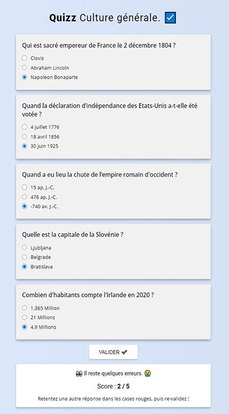
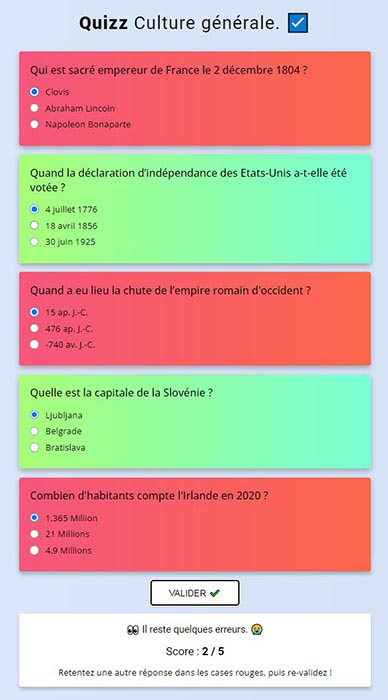

# Coder un Quizz
Autoriser: 
   
  

Le but de ce projet est de coder un quiz qui affiche des messages et des couleurs différents en fonction des résultats.
Vous pouvez faire un quizz sur n'importe quel sujet (star wars, pokémon, les chats, etc...)

 

### A. Coder une interface basique
> Codez d'abord une interface très simple, contenant les éléments importants : boutons, inputs, liens, etc...  
> Rajoutez un peu de style si besoin est. 
>  
> Puis codez les fonctionnalités JavaScript.

 

### B. Fonctionnalités JavaScript à coder pour ce projet

1. Gérez le formulaire.
2. Testez les résultats.
3. Ajoutez un message dans le bloc de fin en fonction des résultats.
4. Ajoutez des couleurs en fonction des résultats.
5. Gérez la possibilité de tentative de correction de la part de l'utilisateur (changer une valeur et re-valider).
   
 

### C. Ajoutez du style à l'interface afin de terminer le projet.

Résultat :

